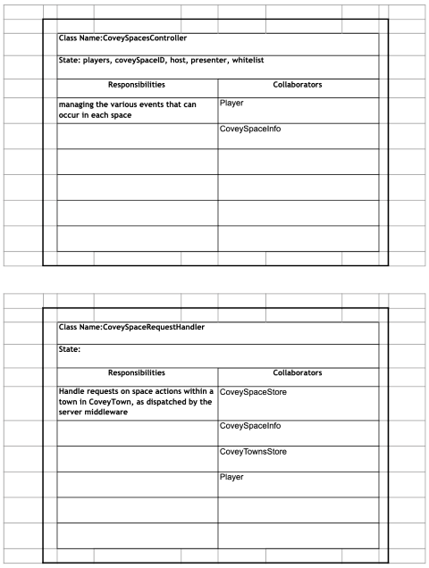
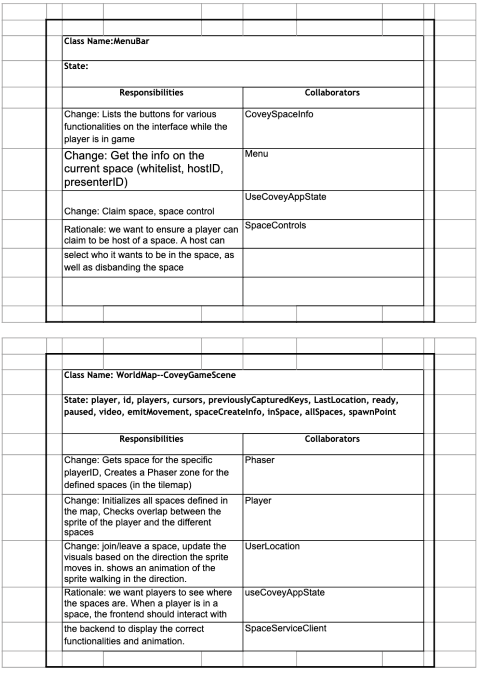

# Covey Space Designs

### Description of archetecture and changes

##### Changes:

Some of the major changes to Covey.Town include, Adding spaces files, changes to the map to add hitboxes for a space, and using towns.ts to act as a router for the covey.spaces
The spaces files that we added include:
- CoveySpaceController
- CoveySpacesStore
- CoveySpaceRequestHandlers
- SpacesServiceClient
- SpaceRestClient

In the map we just generally added space functionality within and a hitbox that was used to mark a covey.space and to connect where the space is on the map with its location in the backend

We also added general routing commands to towns.ts after the comment "// This is where the space routing starts". We added functionality for Posting a space Id, getting all spaces, getting a specific space, putting a player in a space, removing a player from a space (delete), and updating a space (patching). The updating a space functionality is also used to 
- claim a space
- disband a space
- change hosts
- change presenters

All other files dealing with the town itself remained the same.

##### Architecture
Essentially uses the same architecture as the orriginal code. The architecture uses Rest, and web sockets that we edited to work with spaces as seen above. More information in UML Diagram

### CRC and UML Diagrams

working on creating CRC cards/UML diagrams using google doc.
access here:

https://docs.google.com/document/d/16KcxJZgKEppeUxgmWtYGLQIQG7ojapIN_-aylWLFzrY/edit?usp=sharing

